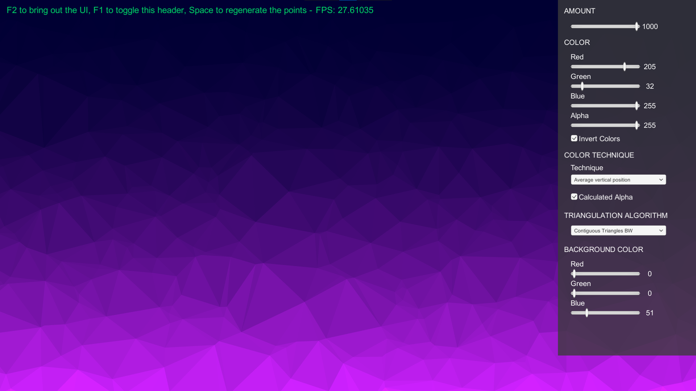

# BowyerWatson_Triangulation_Unity

Bowyer-Watson algorithm is one of the possible approaches to implement the Delaunay triangulation, which takes a set of points and generates a triangulation such that no point is inside the circumcircle of any triangle of the triangulation.

https://en.wikipedia.org/wiki/Delaunay_triangulation

The algorithm consists in incrementally adding the points of the set to the triangulation, removing any triangle whose circumcircle contains the point leaving a star-shaped polygonal hole, which is then triangulated using the new point as a vertex of each new triangle.

## Rendering

This whole project is inspired by Sebastian Lague's intros (for example https://www.youtube.com/watch?v=X-iSQQgOd1A), check him out if you're interested in, quote, "creating stuff out of code".

This code attempts to render some interesting procedural graphic effects based on the properties of each triangle, such as vertical position, area, or distance from the center.

## Implementation
Two different methods for the BowyerWatson triangulation are implemented: a slower one that brute-forcely scans the whole triangulation to find the triangles to remove, and a fast one which works on the assumption that only contiguous triangles will contain the point in their respective circumcircle.

The quick implementation works by searching for the first triangle containing the point in its circumcircle, then checking each contiguous triangle recoursively until no match is found. This method allows for much quicker triangulation, but adds complexity in managing and mantaining the contiguity between triangles.

## License

Copyright 2021 Gardazzo

Permission is hereby granted, free of charge, to any person obtaining a copy of this software and associated documentation files (the "Software"), to deal in the Software without restriction, including without limitation the rights to use, copy, modify, merge, publish, distribute, sublicense, and/or sell copies of the Software, and to permit persons to whom the Software is furnished to do so, subject to the following conditions:

The above copyright notice and this permission notice shall be included in all copies or substantial portions of the Software.

THE SOFTWARE IS PROVIDED "AS IS", WITHOUT WARRANTY OF ANY KIND, EXPRESS OR IMPLIED, INCLUDING BUT NOT LIMITED TO THE WARRANTIES OF MERCHANTABILITY, FITNESS FOR A PARTICULAR PURPOSE AND NONINFRINGEMENT. IN NO EVENT SHALL THE AUTHORS OR COPYRIGHT HOLDERS BE LIABLE FOR ANY CLAIM, DAMAGES OR OTHER LIABILITY, WHETHER IN AN ACTION OF CONTRACT, TORT OR OTHERWISE, ARISING FROM, OUT OF OR IN CONNECTION WITH THE SOFTWARE OR THE USE OR OTHER DEALINGS IN THE SOFTWARE.
